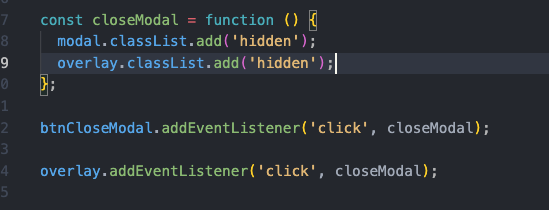
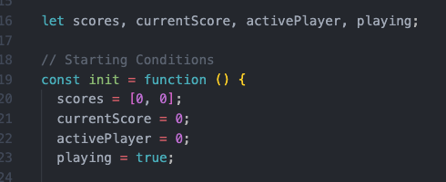

# Javascript in the Browser: DOM and Events Fundamentals

## 04/05/23

- to select an element with class of message, use the query selector from inside the document, the argument passed in parenthesis is the item searched for in quotes

- with multiple dot operators, they are executed from left to right, so to access a property of item in the query selector, in this case textContent, follow the query selector with the property name after a dot

- first input to addEventListener method is the type of event, in this case a click

- second argument passed to addEventListener is the function that tells the app what to do when the event occurs

- with dom manipulation, also select the body with query selector, then change styles by following with dot style and then the style property in camel case and the value as a string

## 04/06/23

- query selector only targets the first item in the document that matches the search, not all of them

- instead search for all of an item to access the node list of the items, which is similar to though not exactly like an array

- when accessing the class list of an element from js, do not put dot in front of class name because it is already known to be a class name based on the classlist method

- when an event calls a function, do not follow the function name with parenthesis in the event argument second input, or it will be called immediately upon rendering the page instead of on event

- global events, like keyboard events, add listener to entire document

## 04/11/23

- the js img src property can be applied directly to the element for whose html attribute you intend to modify, instead of setting the src attribute

- declare multiple variables at once by separating with comma, here they are declared globally ,outside of the function in which they are first assigned, so that they'll be available to other parts of the code as well

