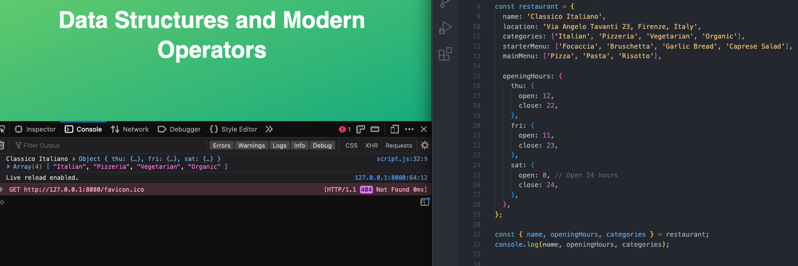

# Data Structures, Modern Operators, and Strings

## Destructuring Arrays and Objects

### 4/13/23
- destructure an array buy setting the variables you'd like to assign to each item in array equal to the array itself, note original array is still intact and accessible as well

- array items are matched to variables in order, skip an item by leaving a blank between commas

- clunkier method to switch array items by first reassigning to a temporary variable to store the value while switching

- easier method to switch placement-order of array items with destructuring by just reassigning

- create a method inside an object, then call that method, and access the arrays inside the object to create a new array

- destructure the array to assign variables to the individual array elements inside the object, allows you to receive more than one variable from just one function call

- use destructing to access nested array contents

- or destructure nested array at same time as parent array with additional square brackets

- assign default values to destructed array variables before equating them to the array, so that in the case that there is no matching array item, it does not just equal undefined

- unlike destructuring arrays, in objects, order doesn't matter, so you don't need to leave blanks with commas to skip parts, instead specify the property keys as the variables

- to change the variable names of object items, reference the property names first followed by a colon and the new name, this is especially useful when using 3rd party data, like from APIs

- like with arrays, you can assign default values for the variables, in case a desired property is not in the original object to avoid undefined result, combine rename with default with colon and equals sign

- cant start w const bc changing values, nor let bc the let is already declared before for a and b, cant start a line w curly braces bc js expects a code block, so wrap all in parenthesis when mutating variables in an object

- destructure nested objects

- destructure nested objects and rename the variables

- define default values within the object parameters, in case the argument does not have an assigned value

- the spread operator, written with three ellipsis dots, allows you to expand an array into all of its elements at once, instead of doing it manually, can then insert into new array, or access the entire array contents outside of the array

