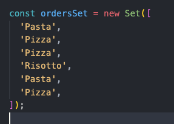

# Sets and Maps

- create a set with new Set keywords then pass it an iterable inside the parenthesis

- sets are like arrays in that they have individual items, io key-value pairs, but different bc each element is unique, even if passed duplicates and order doesn't matter

- strings are also iterable, and so can be passed into a set

- check size or info contained in a set

- add or delete method for sets allows you to change contents

- empty the set with clear

- this doesn't work- sets do not have indexes like arrays, so there is no way to get data out of a set. It's not necesary to get the data like an array because order doesn't matter and there are no duplicates, so the only thing to check is whether an item is in the set or not using the has method.

- sets are iterable and so can be looped throug

- the main use for a set is to remove duplicate values from an array

- because both sets and arrays are iterable, set can be converted to array with spread operator

- the easiest way to create a map is to create an empty map without passing anything in

- and then pass the info with the set method listing key value pairs

- the set method automatically returns the updated map with the data that was passed in the method

- chain each key value setting for the map to the previous with period dot between

