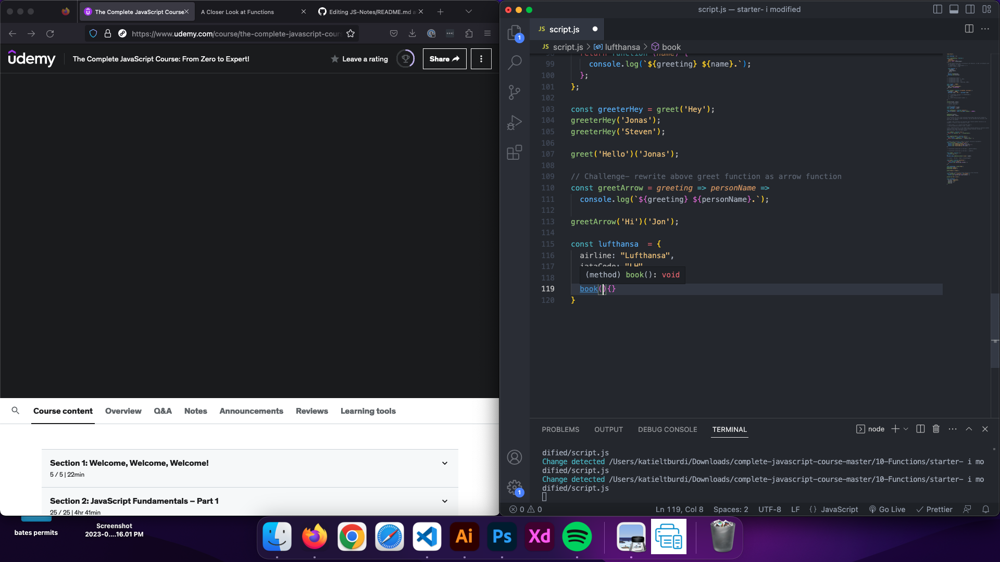
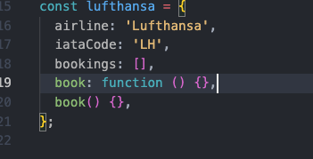
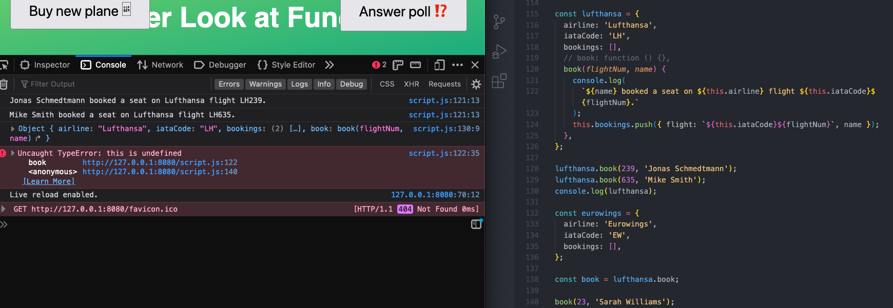
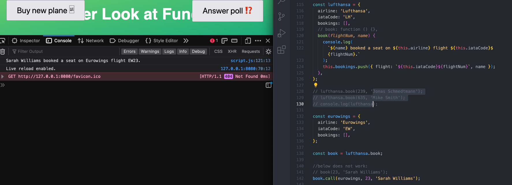
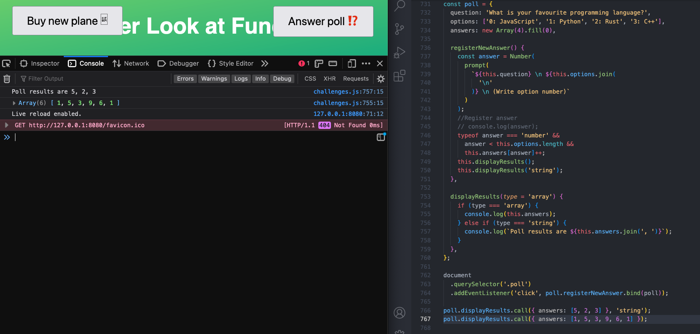
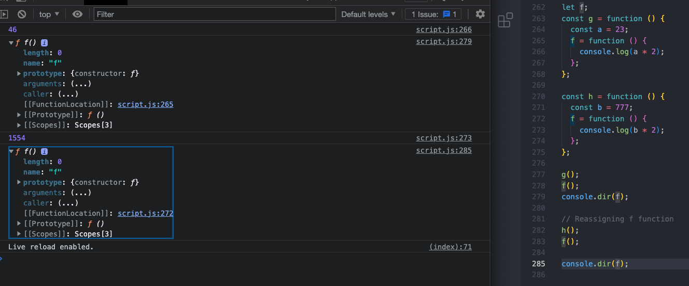
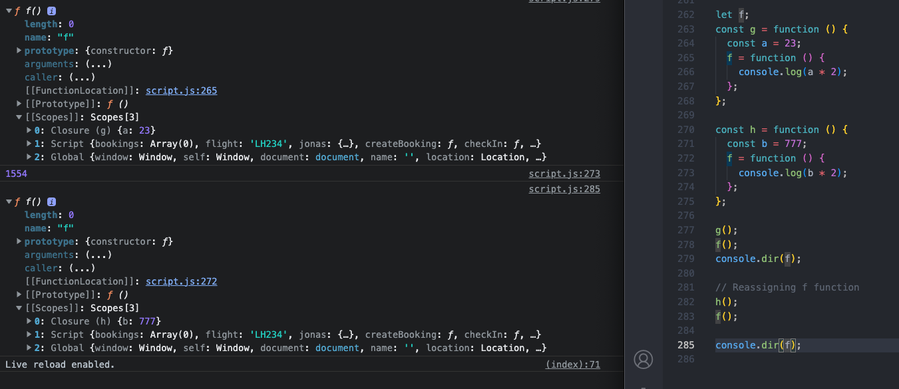

# Section 10: A Closer Look at Functions

## 5/8/23

- Use defualt values of other parameters set before a parameter in its default (like a variable):

- when inputting arguments, you cannot skip a parameter to fill in next argument, as a workaround, set it as undefined, which in this case, just pulls the defualt value instead

- flight const is primitive value, which copies the value of flight into the var flightNum when the function is called, so that when flightNum is assigned inside the function, it's like a separate variable, ref value

- hovering flightNum variable shows that it was never used in the function

- js functions are first class functions which means they can be treated as values, can be passed to other functions, can be returned from functions, and have their own methods
- higher order functions are functions that receive another function as an argument or returns a new functions or both
- here, addEventListener is the higher-order function because it receives another function as an input, and greet is the callback function, called by addEventListener when the event happens

- functions also have their own properties, such as name, which connects to the name of the function

- a function returned inside a higher order function can then be stored in a new varibale when it is called

- when two separate arguments are passed to a higher-order function, the first argument is passed to the called function, and the second argument is passed to the return function it contains

- enhanced object literal sytax to write a method for an object without defining a function

- enhanced object literal sytax to write a method for an object without defining a function

- when nested function/method is pulled out of a higher-order function it is like a regular function, which does not have a "this" keyword, so when trying to call it, anything referring to the this keyword is undefined

- to use the internal method with a this keyword, you must explicitly define it, using either call, apply, or bind function methods

- in the call method, the first parameter is what the "this" key word should point to, followed by the other parameters the method requires, this technique allows you to use a method from inside a function with a different function

- apply method does not receive a list of arguments like call does but instead the this keyword reference and then an array

## 5/9/23
- call method also takes array as input using the spread operator

- bind allows to manually set this keyword meaning in the input, but bind does not immediately call the function, but returns a new function where the this keyword is bound

- after setting the bind method, you can use an internal function that has been pulled out of a higher order function as if it has its own this keyword

- in the bind method, like in call method, can pass "this" keyword definition, as well as other argument defaults

- to skip adding a this keyword definition with bind method, input null

- use call method to reassign answers array referenced in poll object outside of it

- wrapping an unnamed function into parentheses transforms it to an expression, also stops it from running until it is called- call immediately by following with empty parenthesis

- IIFE- immediately invoked fuction expressions- functions used once and never again, "disappears" after called

- scope reminder- let and const variables declared inside a block are not accessible outside, but var variables are

- console dir gives access to the internal properties of a given function when called on it

- scopes property show in the console dir contains the closure info and the VE of the function

- double square brackets in console means it is an internal property that cannot be accessed from the code

#### Closures
- a closure is not manually created, it happens automatically in certain situations
- a function always has access to the variable environment of the execution context in which the content was created
- closure is the variable environment that follows the function from its creation
-Closure Definitions
-a closure is the closed-over VE of the EC in which the function was created, even after the EC is gone
- a closure ensures that a function doens't lose connection to the variables at it's creation
- a closure is like a backpack that a function carries wherever it goes. The backpack contains all of the variables that were present in the environment in which the function was created.

- you don't need to return a function from another function to create a closure

- reassigning the value of a function variable redefines its VE

- closure has priority in the scope chain, so this perGroup global variable declared outside the function is overwritten and does not have precidence

- ...unless the internal perGroup variable is removed

- Note: console dir display is different in firefox than in chrome. these views are from chrome
