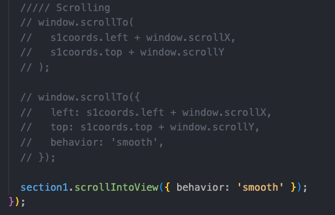

# Advanced DOM and Events

### 6/30/23

#### DOM API Organization Breakdown

- To select the entire html document of a webpages, select the documentElement. (Just document alone is not a real dom element, so it is not enough to select.)
- for documentElement, head, and body, no additional selector is needed

#### Creating and Inserting Elements
- prepend will add the new element as the first child of the parent element you're adding to
- append will add as last child of the specified parent element
- prepend and append can also be used to move elements to first or last child positions (not just insert them)
- this means that you can't have duplicates of an element by both prepending and appending it
- as a workaround, to insert it more than once, clone the element and its children with cloneNode

- before and after insert the new element as a sibling of the specified element

### 7/5/23

- using the style method to apply new styles to an element in js automatically creates inline styles in the html (rather than a separate style in the css file)
- to log style info to the console, the style must be applied as in-line (can't pull from stylesheet)
- Use "getComputedStyle" to pull the style from the stylesheet. The computed style refers to the actual style, as it appears on the page.

- getComputedStyle returns a string, so use Number.parseFloat to convert back to a number when manipulating the style.

- the documentElement (described above) accesses the root element, so to change a CSS variable's property, first access the root, where CSS variables are stored
- the two inputs to the setProperty method are 1- which property to set, and 2- what to set it to (it's new value)

- access standard properties for a given element by chainging their names to the element in js
- to access class, use "className" (historical reasons) instead of just class
- to read non-standard attributes from the dom, which would otherwise return undefined using the same method used for standard attributes, instead use "getAttribute"

- chaining attribute names or setAttribute (instead of getAttribute) can be used to set the attribute's value

- chaining src/href attribute to element will provide the absolute (entire) url, including root
- using "getAttribute" for src/href of an element will provide the relative source, as written in the html, relative between the html file and the element's location
- for external links, this might not matter, as the link in the html is usually the same absolute url, but for internal links the two methods can return different results (absolute vs relative)

### 7/6/23
#### data/ dataset
- Data is a special attribute, so that anything that starts with "data-" as an attribute will be saved in and accessible as "dataset" in the js. Assigned name should be hyphenated in html and camelcased in js (ex: "version-number" for html and "versionNumber" for js).

#### classes
- Don't use "className" to add classes as this will override all existing classes and only allows to add one class to an element.
- for manipulating classes on elements, use: "add", "remove", "toggle", or "contains" methods

#### Dom Measurements and Scrolling
- "getBoudingClientRect" on an element provides the DOMRect, which is its coordinates/ measurements in px.

- use window "scrollX"/ "scrollY" to get the scroll location of the page
- use document "clientHeight"/ "clientWidth" to get the viewport height/ width

- use window "scrollTo" to designate where to scroll on the page, with first parameter: left position, second parameter: top position
- add the top/left coordinate of the desired scroll location to the current y/x scroll position to prevent scroll from relying on different y/x measurements, based on where the page is currently scrolled to when the scrollTo method is called
- to implement smooth scrolling and include the smooth scroll behavior, pass an object of scroll parameters (left, top, and behavior) instead of individual parameters
- the simpler, more modern (only works in modern browsers) method to apply smooth scroll behavior is to use "scrollIntoView" method applied to the element to which you want to scroll with an input of the scroll behavior as an object, rather than passing scroll to location calculations into the object

- 
