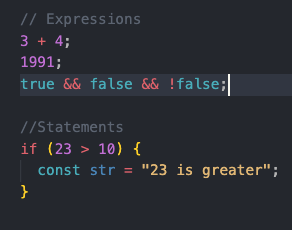
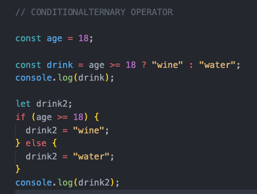
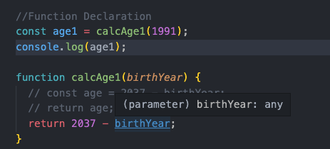
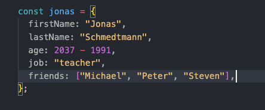
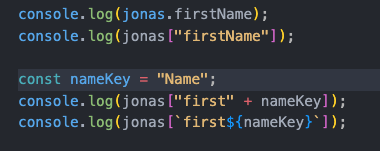
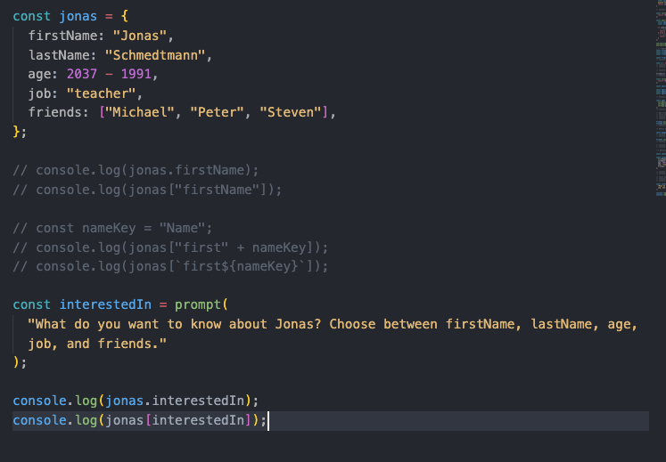
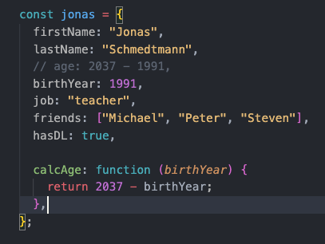
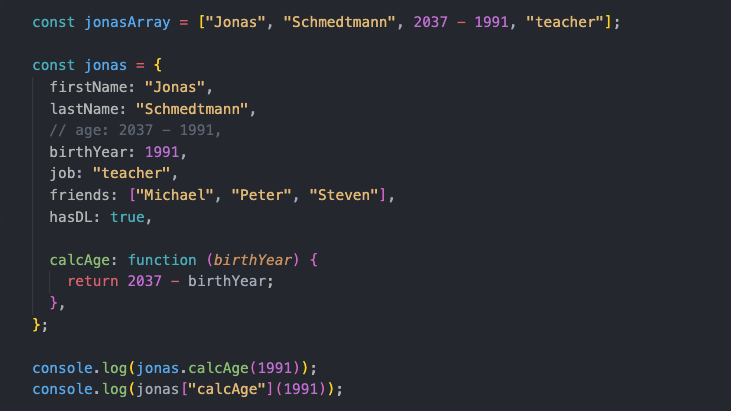
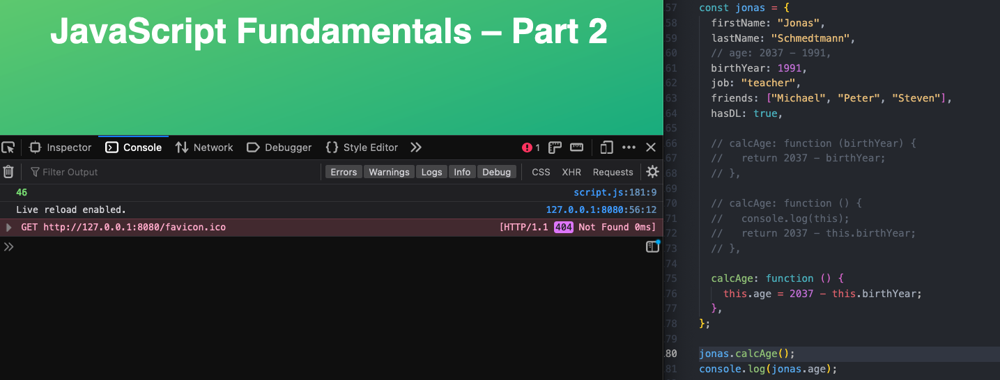

# Section 3: Javascript Fundamentals- Part 2

## 3/31/23

- expressions produce a value, while statement declarations do not, statements are usually larger pieces of code that get executed
- statement declaration is like a complete sentence, and expressions are like the words
- expressions produce values, statements produce actions

- only expressions, not statements, can be inserted into template literals

- first part is condition followed by question mark then result if condition is met

- followed by colon then else statment- if condition is not met

-  the ternary operator lets you make a comparison inside the variable, so instead of using an if else statement, it can be used as an expression, without predefining the variable first

- to set js to strict mode, use strict must be the first line of code in the file, only comments can come before because they'll be ignored, strict mode makes it easier to avoid accidental errors

- the process of using a function is colled invoking, calling, or running the function

- in a js function, the parameter is the placeholder in parenthesis in the function definition, and the argument is the value assigned to it when the function is called

- an anonymous function can be stored in a variable and used like an expression, while a regular, named function is a declaration and cannot

- function declarations can be called before they are defined in the code, but function expressions cannot

- an arrow function works like a function expression, but with even less code to write, can be stored in variable, with parameter in parenthesis and the return after the arrow, arrow functions also have no "this" keyword

- in a more complex, multi-line arrow function, that requires curly braces after the arrow, the word return must be added to return statement

- it's common practice to return neg 1 or 9999 as the else option when a condition is not met when the inputs are numbers

- code written after a return statement, like the console log here, will be ignored because the return statement exits the function

- define an array with either square brackets or the new keyword before the capitalized version of it as a function with contents in function parameters

- pull the last element of an array by subtracting one from the length inside the square brackets for its index

- can change contents of array treating each element like a variable with square bracket and index

- push or unshift a new element to an array automatically returns the new length of that array

- pop removal method returns the element that was removed, not the length like push or unshift 

- shift removes first element of array

- calling the indexOf method on an element not included in an array returns neg 1

## 4/3/23

2023-04-03 1 js object ex, w key - aka property- and value pairs, like an array, but with can identify the items contained without just referencing index number, this version of object is called object-literal syntax bc all clearly defined

2023-04-03 2 pull data from an array using either dot followed by key property or square brackets with key property in quotes

2023-04-03 3 with the bracket method of obtaining values, you can also construct an expression, ex with concatenation or template literal rather than just explicitly writing the key property string as in the dot method

2023-04-03 4 the brackets can also be used to access info that isn't yet determined, while the dot would look for a literal property of the same name in the object, rather than the variable equivalent

2023-04-03 5 both dot and square brackets can be used to add key value pairs to an object

2023-04-03 6 expression function can be stored as key value pair inside an object, with function name as key property and function body as value

2023-04-03 7 insert arguments to functions within objects by placing the parenthesis outside of the square brackets with the key property function name

2023-04-03 8a the this variable equals the object that calls the method, in this case the jonas object calls the method from the console log, so the this keyword refers to the jonas object

2023-04-03 8b the this keyword variable allows you to access an object from a function inside that object, the this keyword refers to the object calling the method

2023-04-03 8c for arguments that are already part of the object, do not repeat, instead include it in the return using the this keyword variable

2023-04-03 8d you could replace the this keyword with the actual name of the object, and it would work, but that violates the DRY method, which could break the code in the future

2023-04-03 9 in the case where the result of the function in an object might need to be used more than once in the code, it helps to then store it in a new key value pair in the function, here that is age property

